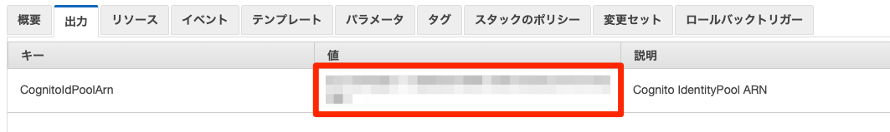

Client
===
Step2で作成したバケットにアップロードする

cfn: step2.yml line61
```
BucketName: !Sub "dist-movie-source-${AWS::AccountId}"
```

## index.html
Step3の出力したCognito Arnをline14に記載
```
IdentityPoolId: 'YOUR_COGNITO_ARN',
```

