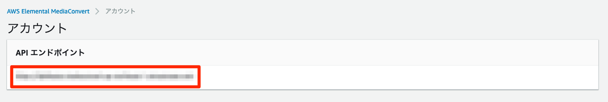

Lambda
===

* tsファイルをコンパイルしてZip化する。
* ソースアップロード用バケットを作成し、step1.yml line45, step2.yml line44に記載する。zip化したソースをアップロード。

## 修正箇所
### put-dynamo
* 特になし

### start-movie-convert
* line2: MediaConvertのコンソールで確認できる**エンドポイント**を記載
```
const MediaConvert = new Aws.MediaConvert({endpoint: 'YOUR_MEDIA_CONVERT_ENDPOINT'});
```



* line8: MediaConvertが利用する**IAMロール**を記載
```
'Role': 'arn:aws:iam::YOUR_AWS_ACCOUNT_ID:role/movie_convert_role',
```

```
MovieConvertRole:
    Type: "AWS::IAM::Role"
    Properties:
      RoleName: "movie_convert_role"
      AssumeRolePolicyDocument:
        Version: "2012-10-17"
        Statement:
          - Effect: "Allow"
            Principal:
              Service:
                - "mediaconvert.amazonaws.com"
            Action:
              - "sts:AssumeRole"
      ManagedPolicyArns:
        - "arn:aws:iam::aws:policy/AmazonAPIGatewayInvokeFullAccess"
        - "arn:aws:iam::aws:policy/AmazonS3FullAccess"
```